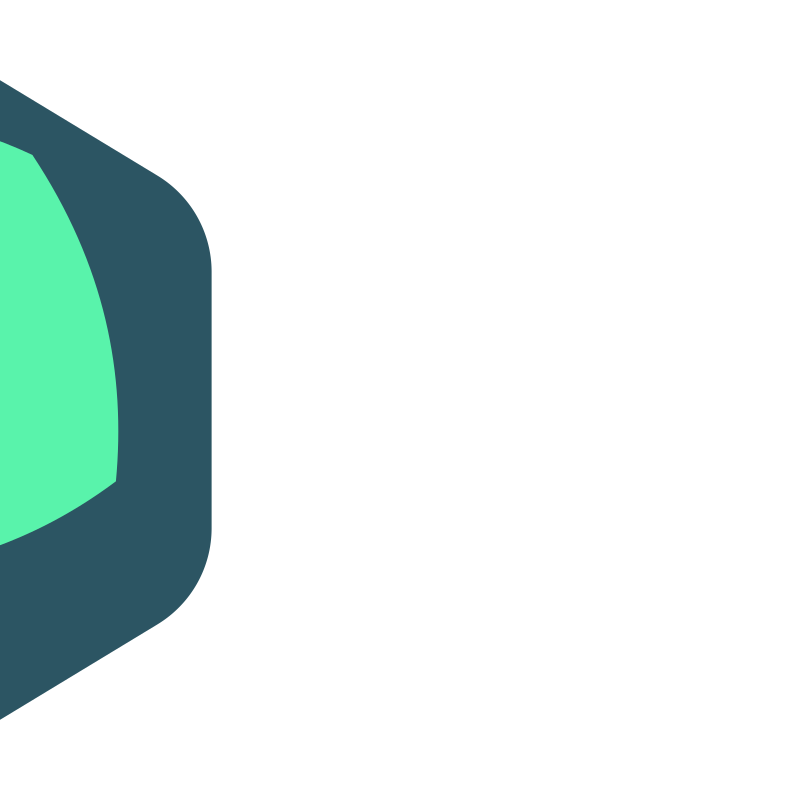

<div align="center">




<h1 align="center" >Discord Clone</h1>


[](https://choosealicense.com/licenses/mit/)


  <p align="center">

  **Spectrum Store | A Robust E-commerce Platform Powered by Next.js, TypeScript, and Shadcn**

  **That leverages the [Fake Store API](https://fakestoreapi.com), It features an Admin dashboard and JWT auth.**

 Designed with a focus on security, it implements best practices for routing and server actions.
    <br />
    <br />
    <a href="https://discord-clone.vercel.app">View Demo</a>
    .
    <a href="https://github.com/issam-seghir/discord-clone/issues">Report Bug</a>
    .
    <a href="https://github.com/issam-seghir/discord-clone/pulls">Request Feature</a>
  </p>

<br>
<hr>

</div>

<br>


### Built With

- 
- 
- 
- 
- 
- 
- 
- 

## Features


- Real-time messaging using Socket.io
- Send attachments as messages using UploadThing
- Delete & Edit messages in real time for all users
- Create Text, Audio and Video call Channels
- 1:1 conversation between members
- 1:1 video calls between members
- Member management (Kick, Role change Guest / Moderator)
- Unique invite link generation & full working invite system
- Infinite loading for messages in batches of 10 (@tanstack/query)
- Server creation and customization
- Beautiful UI using TailwindCSS and ShadcnUI
- Full responsivity and mobile UI
- Light / Dark mode
- Websocket fallback: Polling with alerts
- ORM using Prisma
- MySQL database using Planetscale
- Authentication with Clerk

### Technique

- **Next js 14** Last features
- **Next js** **Server Actions** + **Axios** + **Zod**
- **React hook form** + **Validation** with **zod** for both **Client** & **Server**
- **Authentication** JWT + Cookies  + **Authorization** DATA Layer + **Middleware**

### Main

- 🔒 **Login** Page With **JWT** Authentication + **Logout**
- 🌍 **Home** **Page** with Grid Layout
- 👜 **Product Page** Showing all Product with **category** **filter**
- 👓 **Product Details** page with **ratting** , **pricing**  & **add cart** button
- 🛒 **Cart Drawer** (add to cart , remove from cart)
- 🔍 **Global** **Search** Functionality
- 🎨 **Theme Toggler** (Light /Dark mode)
- ✨ **Loading** **animations** & **Skeleton**

- 📊 **Admin Dashboard** with CRUD operatons for prouct , pagination , searching charts
- 🛡 **Security in mind** : **Authentication** (JWT + Cookies)  & **Authorization** DATA Layer + **Middleware** & **Server actions** with **validation**
- 🚀 **Optimized SEO and Performance**: The project is optimized for SEO and performance using the latest Next.js features and best practices for **meta** tags and **Next/Image** && **site maps**.
- 🎊 **Responsive Design**


## Note

- you can use any **fakestoreapi** user to login
- for **admin** **role** use only the default values
  - **useranme** : mor_2314
  - **password** : 83r5^_

- You can open Admin dashboard and do CRUD on proudcts by following these steps :
  - make sure you login with admin account (**mor_2314**)
  - click on **user icon**
  - click on **dashboard**


## Getting Started

First, run the development server:

1. Clone or Fork the repo

   ```sh
   git clone https://github.com/issam-seghir/discord-clone.git
   cd ./your_project
   ```

2. Install Dependencies

   ```sh
   npm install
   ```
3. rename `.env.example` file to `.env`

4. Start the server

    ```sh
    npm run dev
    ```

Open [http://localhost:3000](http://localhost:3000) with your browser to see the result.

You can start editing the page by modifying `app/page.tsx`. The page auto-updates as you edit the file.


## Deploy on Vercel

The easiest way to deploy your Next.js app is to use the [Vercel Platform](https://vercel.com/new?utm_medium=default-template&filter=next.js&utm_source=create-next-app&utm_campaign=create-next-app-readme) from the creators of Next.js.

Check out our [Next.js deployment documentation](https://nextjs.org/docs/deployment) for more details.

<!-- CONTRIBUTING -->
## Contributing

Contributions are what make the open source community such an amazing place to learn, inspire, and create. Any contributions you make are **greatly appreciated**.

If you have a suggestion that would make this better, please fork the repo and create a pull request. You can also simply open an issue with the tag "enhancement".
Don't forget to give the project a star! Thanks again!

1. Fork the Project
2. Create your Feature Branch (`git checkout -b feature/AmazingFeature`)
3. Commit your Changes (`git commit -m 'Add some AmazingFeature'`)
4. Push to the Branch (`git push origin feature/AmazingFeature`)
5. Open a Pull Request

<!-- LICENSE -->
## License

Distributed under the MIT License. See `LICENSE.txt` for more information.

## Support Me

<a href="https://www.buymeacoffee.com/issam.seghir" target="_blank"></a>
</div>
